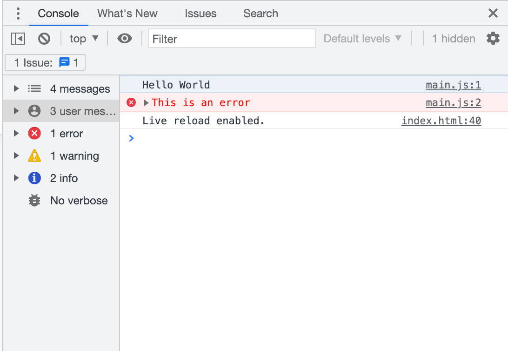
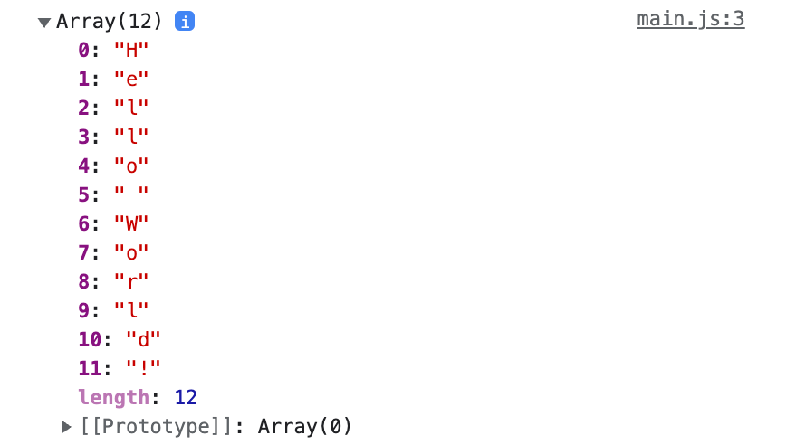
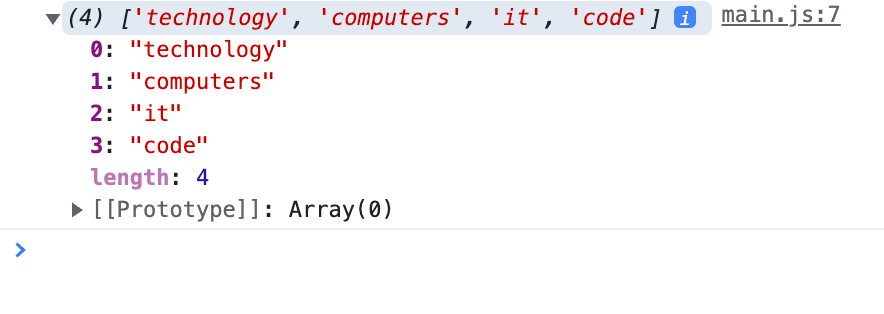

# JS Crash Course Notes
## Based on [this](https://youtu.be/hdI2bqOjy3c) tutorial

---
# 1. The `<Script>` Tag
<!-- <button>Time Stamp</button> -->

<!-- <br> -->

Syntax for external JS is:

> `<script src="main.js"></script>`

<br>

---

# 2. The Console

Console shows up in dev tools when you click inspect in the browser (can also access from IDE). 

> ` console.log('Hello World');`

*This is what it looks like*



Also have the ability to do things other than .log

> `console.error('this is an error');`
> `console.warn('this is a warning);`

<br>

---

# 3. Variables

Three types of variables
- var
- let
- const

## `Var`

Var is the OG variable – but it's outdated since ES6. Especially since it's globally scoped.

## `Let` & `Const`

These are both at "Block-Level" Scope

### `Let`

`Let` is unique becase it "lets" you redesignate variables.

### `Const`

Is a "constant" meaning, once it's assigned it can never be reassigned.

Must assign a value right from the start.

### When to use `let` vs. `const`

Some people say it's best to have the flexibility of `Let` all the time.

But best practice is to always use `Const`, unless you know you're going to need `Let` *(leads to more robust, secure code)*

<br>

___

# 4. Data Types

## Data Primitives

Primitive datatypes mean data is directly assigned to memory. It's not a resource.

### String
```js  
const name = 'John';
```
### Number
```js
const age = 30;
```
### Boolean
```js
const isCool = true;
```
### null
```js
const x = null;
```
### undefined
```js
const y = undefined;
```
### *Symbol**
> *Symbol was only added in ES6 and beyond the scope of beginners*

## Strings

Let's say we have:

```js
const name = 'John';
const age = 30;
```

and we want to log:

```js
console.log('My name is *name* and I am *age*');
```

We have the following ways to do it:

### Concatenation

```js
console.log('My name is ' + name + ' and I am' + age);
```

### Template String

```js
const hello = 'My name is ${name} and I am ${age}';

--then--

console.log(hello);
```

## String Methods

Say we have a string:

```js
const s = 'Hello World!';
```

Now what if we want to get the length of the string we could use the length property (*properties* do not have parentheses, if it has parentheses it's a *method*)

```js
console.log(s.length);
```
This will output:

```
12
```

---
We can also change the case `toUpperCase()`*:

```js
console.log(s.toUpperCase());
```

Will output:
```
HELLO WORLD!
```

*Because `toUpperCase()` is a *method* it needs parentheses. And basically methods are *functions* associated with an *object*.

We can do the opposite as well, `toLowerCase()`:

```js
console.log(s.toLowerCase());
```

Will output:
```
hello world!
```

---
If we want to grab just part of the string, we can use the method `substring(x, y);`:

```js
console.log(s.substring(0,5));
```

This will start at the first character '`H`' index[0], and stop at '`_`' index[5] (without including it).

Meaning the output will be:
```
Hello
```
---
You can even tack on additional methods. For example adding `toUpperCase;`
```js
console.log(s.substring(0, 5).toUpperCase);
```
Which will in turn, output:
```
HELLO
```
---
Another thind we can do is split a string into an array so we have a method called `split()` and then as a parameter, this takes in whatever you want to split by.

If you want to split by letter, you simply pass `''` (without a space) as a parameter.

```js
console.log(s.split(''));
```

Which will output the following array (more on Arrays later):




> ### *More practical use-case for `split()`
> *If you have a form where we're adding a blog post and we're adding tags:*
> ```js
> const blogTags = 'technology, computers, it, code';
> ```
> *Now, you'd want to be able to take that `string` and create an `array` out of it.
> In this case, we would pass the parameter `, ` because in between each word is a comma and a space. So you'd write it like this:
> ```js
> console.log(blogTags.split(, ));
> ```
> *Which would output an array like this:*
> 
> That would be very handy because now you can put that into a database, and you can search to it. 

# `Arrays`

`Arrays` are variables that hold multiple values.


